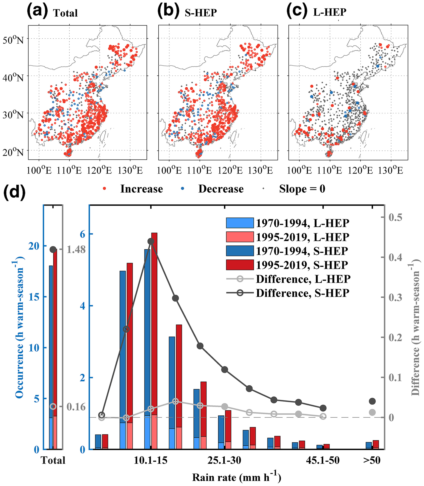

My research is mainly focused on extreme weather and climate.

# Extreme Precipitation
Extreme precipitation, in particular hourly extreme precipitation (HEP), can lead to instant disasters, such as flash floods or waterlogging, resulting in huge losses of human life and property in a short period. Most previous studies have focused on daily extreme precipitation in China. Our study examined how and why HEP has changed in the past half-century. We show that changes in the number of HEP events are mainly contributed by synoptic-scale extreme precipitation in the warm season over eastern China. Furthermore, as the Meiyu front stays longer over northern China in recent years, the number of HEP events have increased in July and August in the lower reach of Yangtze River, northeastern and southern China. These results improve understanding of the response of HEP to climate change and imply that synoptic weather systems might be more important for changes in the occurrence of HEP than local-scale weather systems.

# Hailstorms

