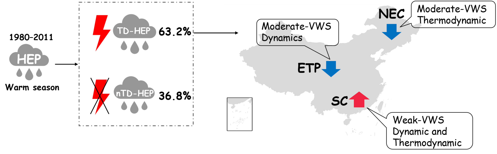
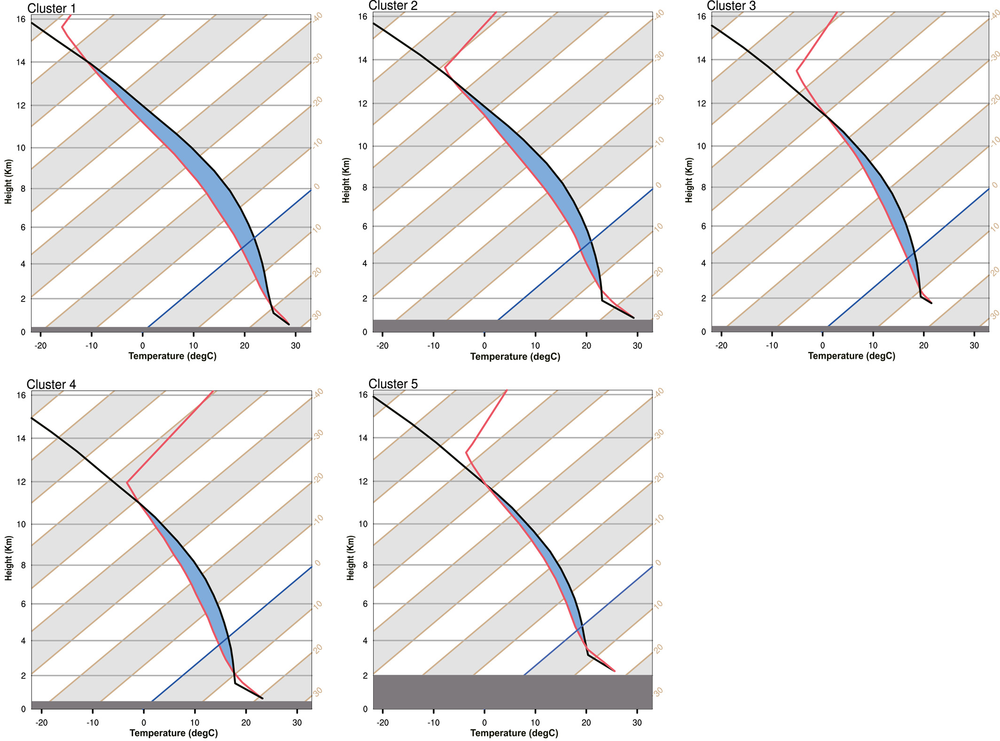
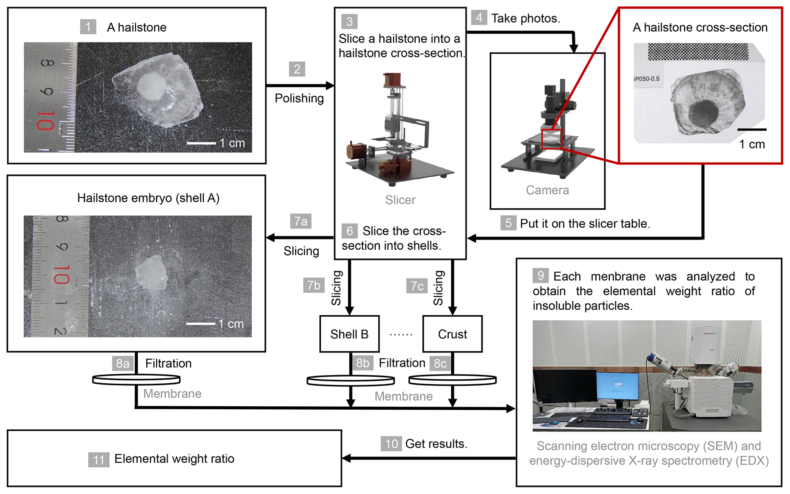
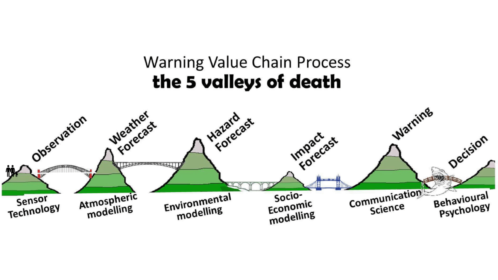

My research is mainly focused on extreme weather and climate.

# Extreme Precipitation
Extreme precipitation, in particular hourly extreme precipitation (HEP), can lead to instant disasters, such as flash floods or waterlogging, resulting in huge losses of human life and property in a short period. Most previous studies have focused on daily extreme precipitation in China. Our study examined how and why HEP has changed in the past half-century. We show that changes in the number of HEP events are mainly contributed by synoptic-scale extreme precipitation in the warm season over eastern China. Furthermore, as the Meiyu front stays longer over northern China in recent years, the number of HEP events have increased in July and August in the lower reach of Yangtze River, northeastern and southern China. These results improve understanding of the response of HEP to climate change and imply that synoptic weather systems might be more important for changes in the occurrence of HEP than local-scale weather systems. [(Ng et al., 2021)](https://agupubs.onlinelibrary.wiley.com/doi/full/10.1029/2020GL090620)

In many countries, thunderstorms are the main contributor to hourly extreme precipitation (HEP). Prior studies have shown that the number of thunderstorms decreased steadily in China; however, HEP has increased significantly in several areas over the past half-century. The role of thunderstorms in changes in HEP occurrence remains largely unknown in China. For the first time, we analyze changes in thunderstorms under various vertical wind shear (VWS) environments, and their contribution to HEP occurrence. The number of HEP events associated with thunderstorms (TD-HEP) increased significantly in southern China (SC) but decreased significantly in northeastern China (NEC) and east of the Tibetan Plateau (ETP). Weak VWS thunderstorms accounted for 69.1% of TD-HEP in SC. Changes in the most unstable convective available potential energy and precipitable water (PW) in SC favored an increase in weak-VWS thunderstorms. As the major contributor to HEP in NEC, moderate VWS thunderstorms decreased due mainly to a reduction in PW, leading to a negative trend in TD-HEP events. Similarly, the decreasing TD-HEP occurrence on the ETP was due to a decrease of moderate VWS thunderstorms. Studying the VWS environments of thunderstorms, and changes therein under a warming climate, can improve understanding of the changes in HEP in China. [(Ng et al., 2022)](https://journals.ametsoc.org/view/journals/clim/35/14/JCLI-D-21-0701.1.xml)

# Hailstorms
The impacts of climate change on the global occurrence of hailstorms are full of uncertainty, which partially results from an incomplete understanding of hail-producing environmental conditions. However, a fundamental limitation of these prior approaches is the use of a single metric or formative mechanism to consider hail occurrence. Leveraging a combination of satellite detection and artificial intelligence clustering method, we demonstrates that there are five distinct environmental conditions producing severe hailstorms globally. The different global environmental characteristics obey a consistent relationship between variables, balancing between unstable conditions, melting level height, and the vertical wind shear. A key finding is that the variety of hailstorm environment types illustrates distinctions in the associated convective mode and possibly embryo type, highlighting that considering only one hailstorm environmental condition is unlikely to capture how these individual environment types respond to climate change.
[(Zhou et al., 2021)](https://agupubs.onlinelibrary.wiley.com/doi/full/10.1029/2021GL095485)

This work is the first study to simultaneously analyze the number concentrations and species of insoluble particles in hailstones. The size distribution of insoluble particles for each species vary greatly in different hailstorms but little in shells. Two classic size distribution modes of organics and dust were fitted for the description of insoluble particles in deep convection. Combining this study with future experiments will lead to refinement of weather and climate models.
[(Zhang et al., 2023)](https://acp.copernicus.org/articles/23/13957/2023/#&gid=1&pid=1)

# Tibetan Plateau Precipitation
The long-term precipitation trend over the Tibetan Plateau (TP) increased significantly during 1981–2015, which was most significant in the northeastern, central, and western TP. The geopotential height field of 500 hPa over TP was divided into 9 circulation patterns (T1–T9), in which T2 and T4 were the dominant circulation patterns (DT) for the increase of precipitation. The geopotential height field of DT was low over the west but high over the east. DT dominated the increase of precipitation was reflected in the increase of precipitation days and daily precipitation. The increase in the number of DTs led to increased precipitation in the central and western TP. Another dominant mechanism was the optimization of precipitation conditions: T2 was dominated by the optimization of dynamic conditions driven by the larger gradient of geopotential height, and T4 was dominated by the optimization of thermal conditions driven by more water vapor. [(Sun et al., 2024)](https://xbna.pku.edu.cn/CN/10.13209/j.0479-8023.2023.082)

# High-impact Weather
Twenty-one runners died of hypothermia during the 100 km Ultramarathon Mountain race in Baiyin, Gansu Province on 22 May 2021. The hypothermia was caused by a combination of low temperatures, precipitation, and high winds associated with a typical large-scale cold front passing by the race site that morning. Based on historical hourly records of 13 meteorological surface stations over the past six years, rainfall was only moderate at this time, but when temperature lower than 3.0°C, gust wind speed greater than 11.2 m/s, and precipitation greater than 0.1 mm for any adjacent three hours were combined together, 1200 LST 22 May fell within the top 0.1% of cases. The ECMWF model produced reasonably good forecasts of the low temperature and high wind one day and seven days before the event, respectfully. Based on this study, lessons that can be learned from this tragedy are summarized from an academic perspective: Hazard and impact forecasts of high-impact weather events should be developed to increase the value of weather forecasts. Probability forecasts should be issued by government weather agencies and communicated well to the public. And more importantly, knowledge of how to evaluate the impact of weather should be delivered to the public. May our efforts honor those who lost their lives by highlighting the value of weather forecasting and calling for greater action in the future. [(Zhang et al., 2021)](https://link.springer.com/article/10.1007/s00376-021-1246-0)

